# AHQ Platform

```mermaid
graph TD
    A[AHQ Platform] --> B[Gestão de Dados]
    A --> C[Serviços Online]
    A --> D[Análises]
    A --> E[Integração com Nuvem]
    A --> F[Backend Supabase]
    A --> G[Banco PostgreSQL]
    
    B --> B1[Entrada de Dados]
    B --> B2[Alteração de Dados]
    B --> B3[Envio para HIDRO]
    B --> B4[Relatórios]
    B --> B5[Banco HidroData]
    
    C --> C1[Relatório Anual]
    C --> C2[Estudos Ambientais]
    C --> C3[Dados de Campo]
    C --> C4[Estação Telemétrica]
    C --> C5[Suporte]
    C --> C6[Análises de Água]
    C --> C7[Sedimentos]
    C --> C8[Cartografia]
    C --> C9[Dashboards]
    
    D --> D1[Consistência]
    D --> D2[Imagens]
    D --> D3[Curva Chave]
    D --> D4[Sedimentos]
    D --> D5[Vazões]
    D --> D6[Qualidade Água]
    
    E --> E1[AWS]
    E --> E2[Databricks]
    
    F --> F1[Autenticação]
    F --> F2[Banco de Dados]
    F --> F3[Edge Functions]
    F --> F4[Storage]
    
    G --> G1[Dados de Estações]
    G --> G2[Séries Temporais]
    G --> G3[Backups]
    
    B1 --> B1_1[Código ANA]
    B1 --> B1_2[Estação]
    B1 --> B1_3[Tipo Dados]
    B1 --> B1_4[Período]
    
    C1 --> C1_1[Editor Template]
    C1 --> C1_2[Histórico Versões]
    C1 --> C1_3[Exportação]
    
    C9 --> C9_1[Usina]
    C9 --> C9_2[Estações]
    C9 --> C9_3[Geral]
```



## Funcionalidades Implementadas

### 1. Gestão de Dados
- **Entrada de dados**
  - Código ANA
  - Estação Telemétrica
  - Tipo de Dados
  - Período de Medição
- **Alteração de dados**
- **Envio para HIDRO**
- **Relatórios**
  - Internos
  - Externos
- **Integração HidroData**

### 2. Serviços Online
- **Relatório Anual**
  - Editor de Template
  - Controle de Versões
  - Exportação
- **Estudos Ambientais**
- **Dados de Campo**
- **Estação Telemétrica**
- **Suporte Técnico**
- **Análises de Água**
- **Sedimentos**
- **Cartografia**
- **Dashboards**
  - Usina
  - Estações
  - Geral

### 3. Análises
- Consistência de Dados
- Banco de Imagens
- Curva Chave
- Sedimentos
- Vazões
- Qualidade da Água

### 4. Integração com Nuvem
- **AWS**
  - Armazenamento seguro de dados
  - Processamento em nuvem
  - Integração com serviços AWS
- **Databricks**
  - Análise avançada de dados
  - Machine Learning
  - Processamento distribuído

### 5. Backend Supabase
- **Autenticação e Autorização**
  - Login seguro
  - Controle de acesso baseado em funções (RBAC)
- **Banco de Dados PostgreSQL**
  - Armazenamento de dados estruturados
  - Políticas de segurança em nível de linha (RLS)
- **Edge Functions**
  - Processamento serverless
  - Integrações com serviços externos
- **Storage**
  - Armazenamento de arquivos e documentos
  - Controle de acesso a arquivos

### 6. Conexão com PostgreSQL

A plataforma oferece integração com bancos de dados PostgreSQL:

- **Conexão Direta**
  - Configuração flexível de parâmetros de conexão
  - Suporte a múltiplas conexões
  - Monitoramento de status de conexão
  
- **Operações de Dados**
  - Queries personalizadas
  - Suporte a transações
  - Cache de conexões para melhor performance

- **Segurança**
  - Armazenamento seguro de credenciais
  - Conexões encriptadas
  - Proteção contra injeção SQL

## Integrações
- WordPress (OceanWP)
- Supabase
- Banco HidroData
- GLPI (Suporte)
- AWS Cloud
- Databricks
- PostgreSQL

## Configuração da Nuvem

### AWS
1. Acesse o Console AWS
2. Configure as credenciais no ambiente seguro
3. Selecione a região desejada
4. Inicie a migração através da interface

### Databricks
1. Acesse a plataforma Databricks
2. Configure o workspace
3. Conecte com as fontes de dados
4. Inicie a migração pela interface

## Configuração do Supabase

1. A plataforma está conectada ao Supabase em: `https://azotnhzhyisqadvvaywj.supabase.co`
2. As tabelas principais incluem:
   - `users`: Armazena informações de usuários
   - `cloud_config`: Configurações de nuvem
   - `reports`: Relatórios gerados pelo sistema
   - `templates`: Templates para relatórios

3. Para verificar o status da conexão:
   - Acesse a página inicial da aplicação
   - Verifique o componente "Conexão Supabase"
   - Clique em "Verificar Conexão" para testar

4. Para operações avançadas:
   - Acesse o Dashboard Supabase em https://supabase.com/dashboard
   - Navegue até o projeto da AHQ Platform
   - Use as ferramentas de administração para gerenciar tabelas e dados

## Configuração do PostgreSQL

1. Configure as variáveis de ambiente no arquivo `.env`:
   ```
   DB_USER=seu_usuario
   DB_PASSWORD=sua_senha
   DB_HOST=localhost
   DB_PORT=5432
   DB_NAME=seu_banco
   ```

2. Utilize o serviço de conexão para se conectar:
   ```typescript
   import { databaseService } from '@/services/databaseService';
   
   // Conectar ao PostgreSQL
   await databaseService.connect({
     user: 'seu_usuario',
     password: 'sua_senha',
     host: 'localhost',
     port: 5432,
     database: 'seu_banco'
   });
   
   // Executar consultas
   const result = await databaseService.query('SELECT * FROM sua_tabela');
   console.log(result);
   
   // Fechar conexão quando terminar
   await databaseService.disconnect();
   ```

3. Para monitorar o status da conexão:
   ```typescript
   const isConnected = await databaseService.checkConnection();
   console.log('Conexão ativa:', isConnected);
   ```

## Configuração

1. Clone o repositório
2. Configure as variáveis de ambiente no arquivo `.env`
3. Instale as dependências: `npm install`
4. Inicie o servidor: `npm run dev`

## Suporte

Para suporte, acesse o portal de ajuda através do botão "Ajuda" na interface ou entre em contato:
- Email: suporte@ahq.com.br
- GLPI: http://localhost/glpi
